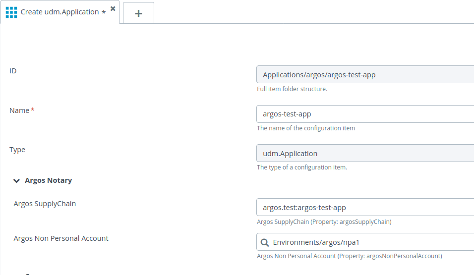
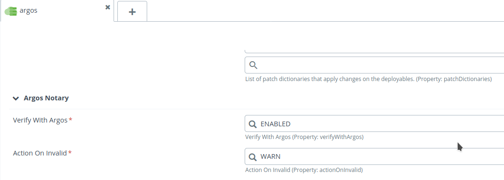
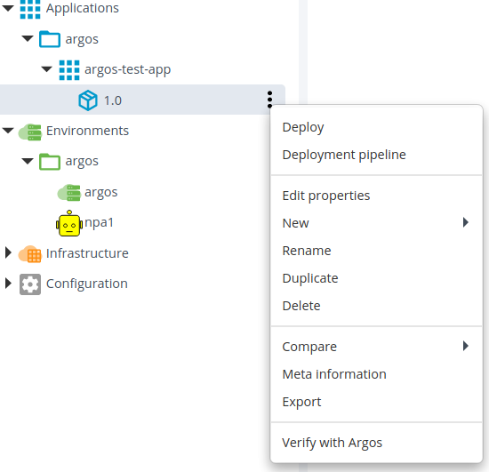

# XLD Argos Plugin 

[](https://cloud.drone.io/argosnotary/xld-argos-plugin) [](https://sonarcloud.io/dashboard?id=xld-argos-plugin)

## Preface ##

This document describes the functionality provided by the XL Deploy Argos Plugin, an interface to the [Argos Software SupplyChain Notary](https://github.com/argosnotary)

## Overview ##

The XLD Argos plugin allows for verifying on the Argos Service that the Deployment Package is created during a valid process. The verfication can be done on the Deployment Package or during every deployment.

## Features ##

* Do an Argos verification on a Deployment Package
* Verify a Deployment Package before deployment.

## Requirements ##

* **XLD Server** 8.0+
        

## Installation

Place the 'xld-argos-plugin-&lt;version&gt;.xlpd' file into your SERVER_HOME/plugins directory.

Place the file 'argos.properties' into your SERVER_HOME/conf directory. With at least the property `argos.service.base.url`.

```
   argos.service.base.url=https://<argos service hostname>/api
```

### Configure XLDeploy Credentials

## Property settings settings.

The following properties can be set in the `argos.properties` file.

| Property                   | Default                   | Possible Values | Description                                             |
|--------------------------- | ------------------------- | --------------- | ------------------------------------------------------- |
| argos.service.base.url     | http://localhost:8080/api |          | Url of the Argos Service                                       |
| argos.service.actuator.uri | actuator/health           |          | uri to check status of Argos Service                           |
| argos.verification.status  | DISABLED                  | DISABLED | do no verification, if not enabled on the Environment          | 
|                            |                           | ENABLED  | do always a verification, independent of Environment setting   |
| argos.action.on.invalid    | NONE                      | NONE     | No action on invalid verification of deployment package        |
|                            |                           | WARN     | Warn on invalid verification of deployment package             |
|                            |                           | ABORT    | Abort deployment on invalid verification of deployment package |
| xld.base.url               | http://localhost:4516/deployit                                          | | Url for this XL Deploy instance to do REST calls |
| argos.xld.client.conf.id   | Configuration/config/administration/argos/xldconfig                     | | argos.xldeploy Ci with XL Deploy credentials     |
| argos.result.prefix        | Package: %s                                                             | | log message prefix                               |
| argos.abort.template       | \ has an invalid Argos Notary Verification, abort                       | | log message on abort                             |
| argos.warn.template        | \ has an invalid Argos Notary Verification, this is a warning           | | log message on warn                              |
| argos.none.template        | \ has an invalid Argos Notary Verification but an action is not defined | | log message on no action                         |
| argos.valid.template       | \ is valid according Argos Notary Verification                          | | log message prefix                               |

## Argos Notary for Deployment Packages and Environment.

### Configuration.

#### Define a Service Account.

For the verification of the Deployment Package an an **Argos Service** account is needed. The account should be created on the same branch as the `SupplyChain`. During this creation a `keyid` and a `passphrase` are presented, these are needed for the configuration in XLDeploy.

Choose in the `Environments` branch in XLDeploy for `New` > `argos` > `ServiceAccount`


Fill in a relevant name and the `keyid` and the `passphrase` of the account in the **Argos Service**


#### Configure Application.

On an `Application` for which the `Deployment Packages` should be verified the `SupplyChain` name in the **Argos Service** should be defined and the `Service Account` which should do the verification.



The SupplyChain name should be qualified in the `Gradle` way `([group name]:[supply chain name])`

#### Configure Environment.

On the `Environments` it is possible to enable or disable the verification during deployment. **The setting in the configuration file `argos.properties` takes precedence over this setting at least if that setting has a higher level.**




| Setting           | Default  | Possible Values | Description                                                    |
|------------------ | -------- | --------------- | -------------------------------------------------------------- |
| Verify with Argos | DISABLED | DISABLED        | do no verification, if not enabled globally                    | 
|                   |          | ENABLED         | do always a verification                                       |
| Action On Invalid | NONE     | NONE            | No action on invalid verification of deployment package        |
|                   |          | WARN            | Warn on invalid verification of deployment package             |
|                   |          | ABORT           | Abort deployment on invalid verification of deployment package |


### Verify a package.

It is possible to check the verification with a task on the `Deployment Package`.



### Verification during deployment.

If verification is enabled, a verification will be done as the first step during every deployment, except for `NOOP`and `DESTROY` operations.

```
    | # [Phased plan] 
    | # [Plan phase] Deploy
    |  * Deploy on localhost
    |    -------------------
    |  1. (  0) - Argos Notary Verification Step  (step: ArgosVerificationStep, rule: com.xebialabs.deployit.community.argos.ArgosVerificationStepGenerator.contribute)
    |  2. ( 10) - Stop tomcat  (step: ScriptExecutionStep, rule: com.xebialabs.deployit.plugin.generic.container.LifeCycleContributor.restartContainers)
    |  3. ( 60) - Create war settings in argos-test-app.xml on localhost  (step: TemplateArtifactCopyStep, rule: tomcat.WarModule.executeCreate_CREATE)
    |  4. ( 70) - Create argos-test-app.war on localhost  (step: ArtifactCopyStep, rule: tomcat.WarModule.executeCreate_CREATE)
    |             *checkpoint*  CREATE Infrastructure/argos/tomcat/tomcat/localhost/argos-test-app.war
    |  5. ( 90) - Start tomcat  (step: ScriptExecutionStep, rule: com.xebialabs.deployit.plugin.generic.container.LifeCycleContributor.restartContainers)
    | # [Plan phase] 
    |  * Register changes for argos-test-app
    |    -----------------------------------
    |  1. (100) - Register deployeds  (step: RepositoryUpdateStep, rule: null)
```

### Collect an Argos Notary Link Object

XL Deploy can generate a Link Object on a Deployment Package and store this to the Argos Notary Service.

#### Run task `collectArgosLink` using xldeploy cli

Run with the cli the following statements or a python script with these statements

```python

	import sys

	package = repository.read(<deployment package version id>)
	control = deployit.prepareControlTask(package, 'collectArgosLink')
	taskId = deployit.createControlTask(control)
	deployit.startTaskAndWait(taskId)

```

The link object will be stored under the `SupplyChain` and using the account both defined in the `Application`.

### Get Artifacts in an Application Version

A REST endpoint extension is added which returns the list of Artifacts defined in a `udm.Version`.


| Method | uri                                         | parameters  | parameter description     |
| ------ | ------------------------------------------- | ----------- | ------------------------- |
| GET    | /api/extension/argosnotary/collectartifacts | application | XLDeploy Application name |
|        |                                             | version     | version                   |
 
| Status | returns         | meaning           |
| ------ | --------------- | ----------------- |
| 200    | json entity     | list of artifacts |
| 400    | error in stdout | iput error        |
| 404    |                 | version not found |         
 
#### Response

```
{
    "entity": [
        {
            "uri": "file uri",
            "hash": "sha256 hash"
        },
        ...
    ],
    "stdout": "",
    "stderr": "",
    "exception": null
}
```

#### example

```shell
   $ http://localhost:4516/api/extension/argosnotary/collectartifacts?application=PetClinic&version=1
```

Returns:

```json
{
    "entity": [
        {
            "uri": "deployit-manifest.xml",
            "hash": "995e418909d8402e93885fa30d212eca41754f51165486266978aedce0337c48"
        },
        {
            "uri": "localFile/sprint review.odp",
            "hash": "659289d6936a753e43bc4dc1cec2e19720c1426ea9fb98b935188449bba4c2a2"
        },
        {
            "uri": "petclinic.war/petclinic.war","hash
            ":"dea61ebf3c08110f9044cf6c48a45da742809d471c1e817fe9a6637aedab3f10"
        },
        {
            "uri": "index.html",
            "hash": "38ffd4972ae513a0c79a8be4573403edcd709f0f572105362b08ff50cf6de521"
        }
    ],
    "stdout": "",
    "stderr": "",
    "exception": null
}
```

